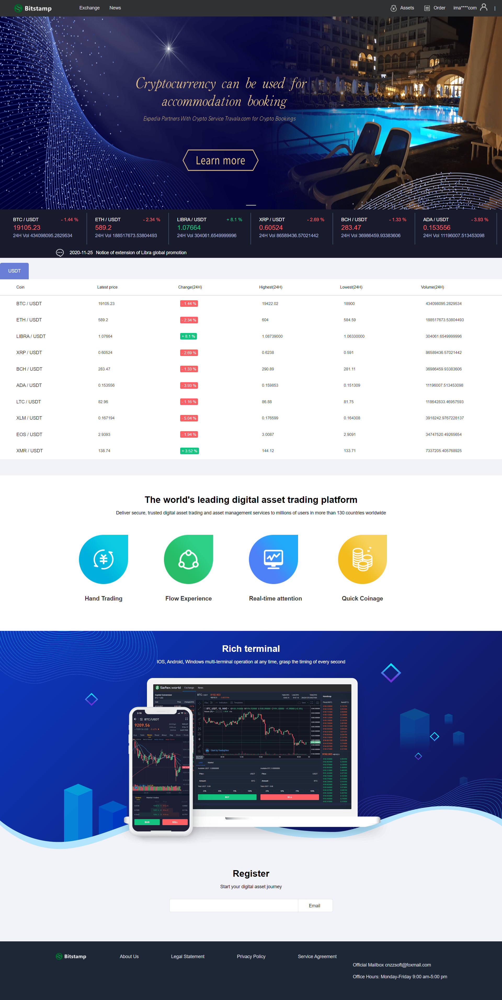
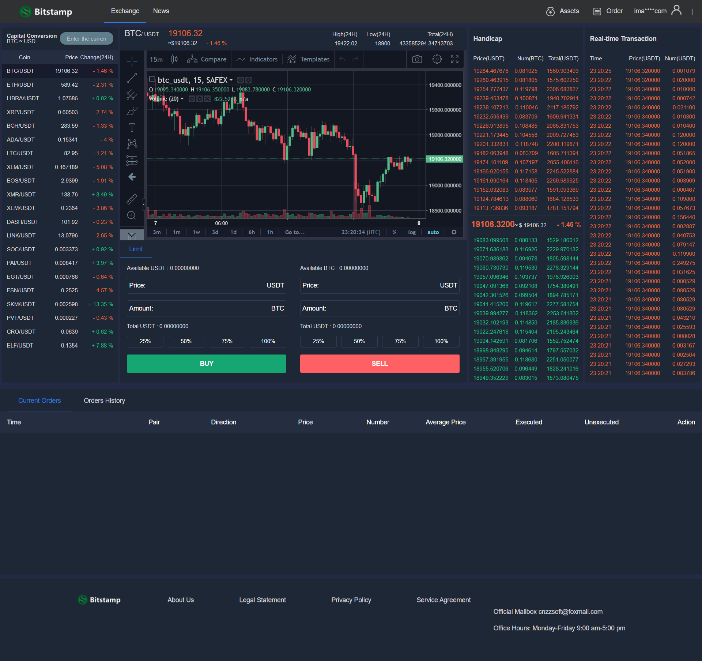
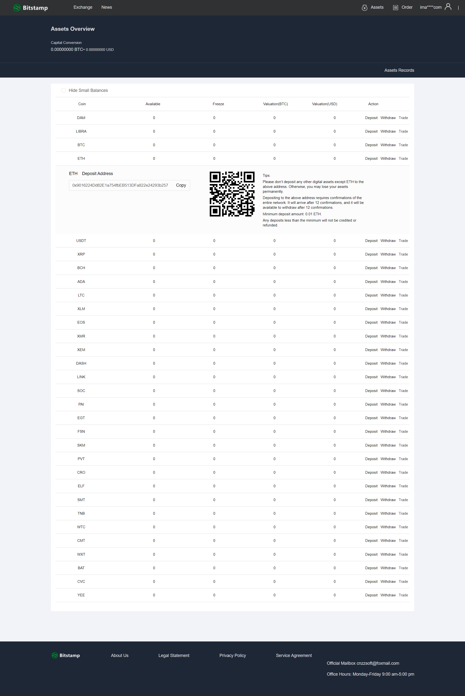
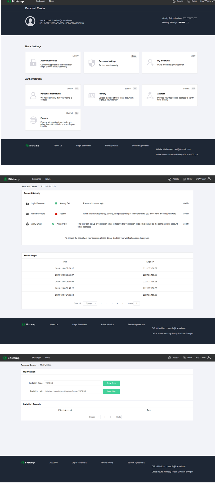
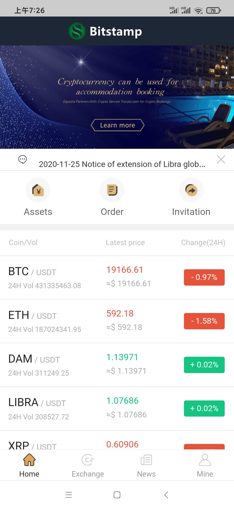
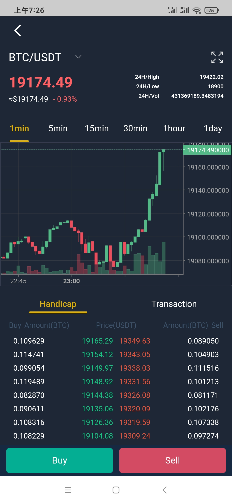
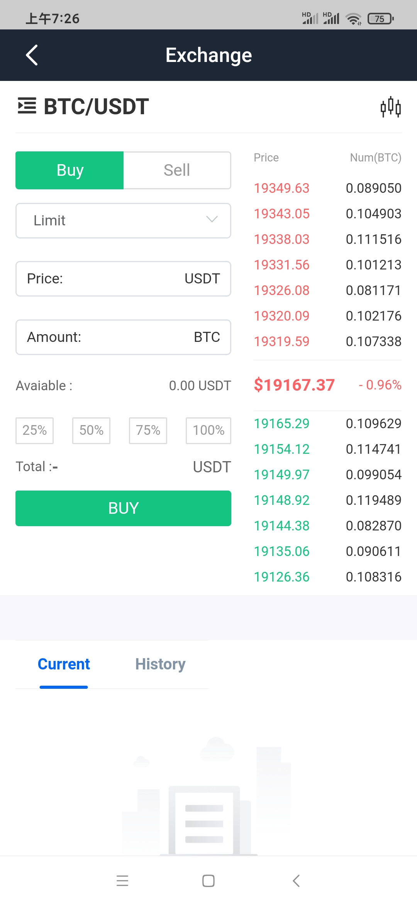
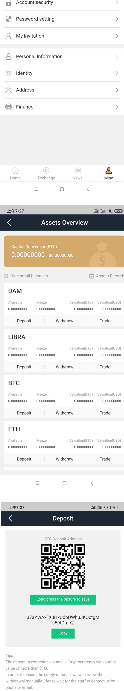
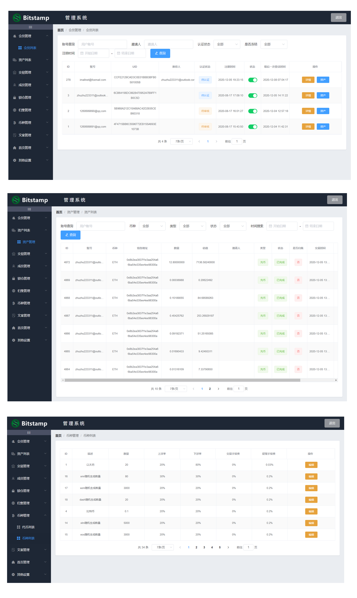

# exchange-english
TG： https://t.me/isdapp

# 全新英文国外交易所，区块链交易所，币币交易，上链，ETH，BTC等全自动到账

功能技术列表：

1：前端：Vue、iView、less

2：后端：Tp6、swoole、opcache、readline、fileinfo

3：节点：ETH采用web3模式，btc采用节点服务器模式。

4：数据库：Mysql、redis

5：Tp6+vue交易所，专为加密货币交换而设计，性能可靠。

6：APP 移动端（IOS+Android）。

7：K线采用目前最专业的Trading View，和火币一样。

8：英语，非常适合在国外经营。

9：支持双层加密，通过两种不同的算法数据，来确保数据的“加密”存储，权限和控制。

10：无缝对接真实BTC，ETH等钱包，安全采用多签名技术。

11:   支持币币交易

12：全自动转入转出钱包功能。

13：支持用户实名认证。

14：对接火币大盘行情，全自动行情采集，自动刷新。

15：曲线自动产生，K线清晰易懂。

16：运营完美版。

## Screenshots

安全的交易所，安全防御如下：

1: 所有钱包端口修改成非常规端口。

2: 硬件防护（所有钱包放入内网机器，无任何外网权限，从而避免黑客调用api接口）。

3: 应用层防护,管理后台只允许内网访问,隔绝外网对钱包操作的高级权限。

4: 钱包key校验规则采用动态密码加静态混合模式，提高钱包自身的安全。

5: 外网采用sll级别的cdn加密加速处理，防止ip泄漏。

6: 应用钱包访问采用多认证（multisignature）在执行一项交易【预算会增加】。

7: 后台地址加key校验以及地址长度高度放大，增加强度。

8: 定期更改各种key和密码。

9: 为了一百的安全，建议定期把大额货币转入线下钱包，做到万无一失。

关于6应用钱包的认证的说明（multisignature）：

1: 本身钱包和服务器通信高强度user和pass密码（1层）。

2: 目前大部分交易所钱包为了方便通讯，没有做encrypt，目前可以通过encrypt手段加固钱包。

   交易所在通讯的时候，通过发送第二层密码，且设置会话超短时间，会话结束后自动
   
   锁定钱包，从而让钱包达到更安全（2层）
